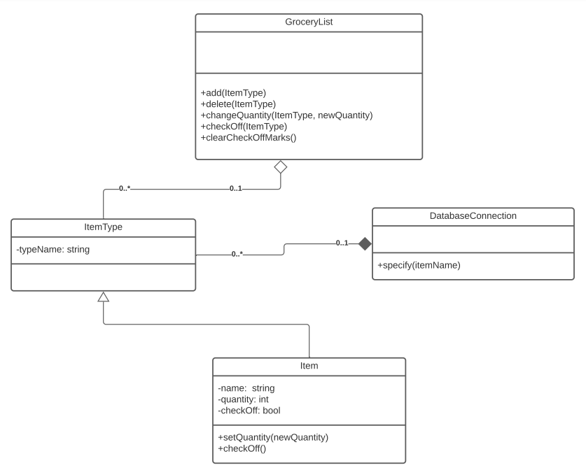
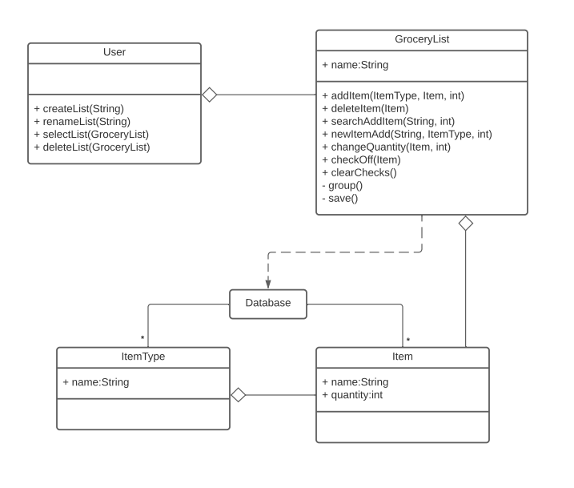
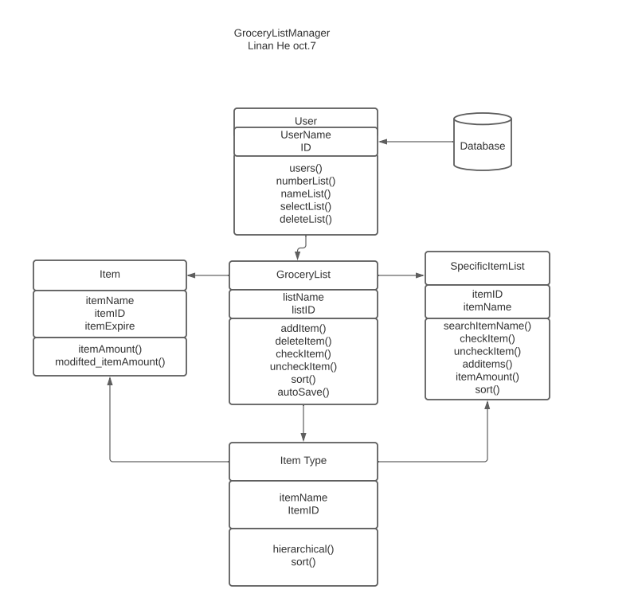
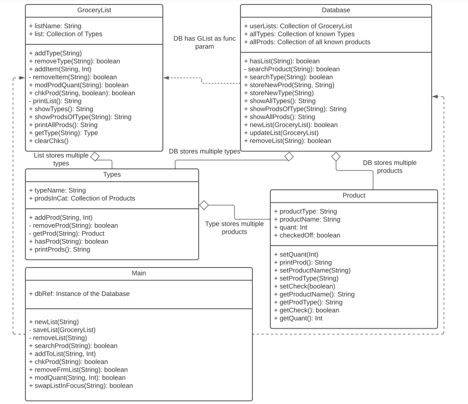
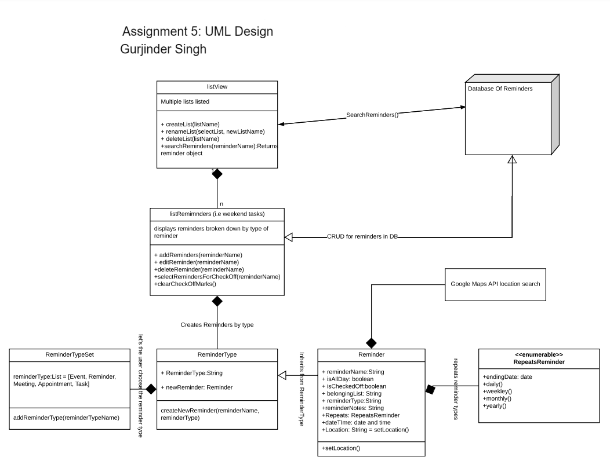
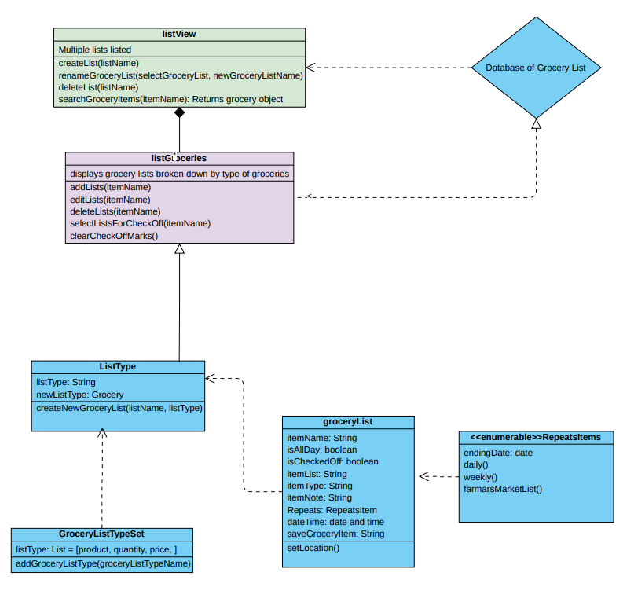
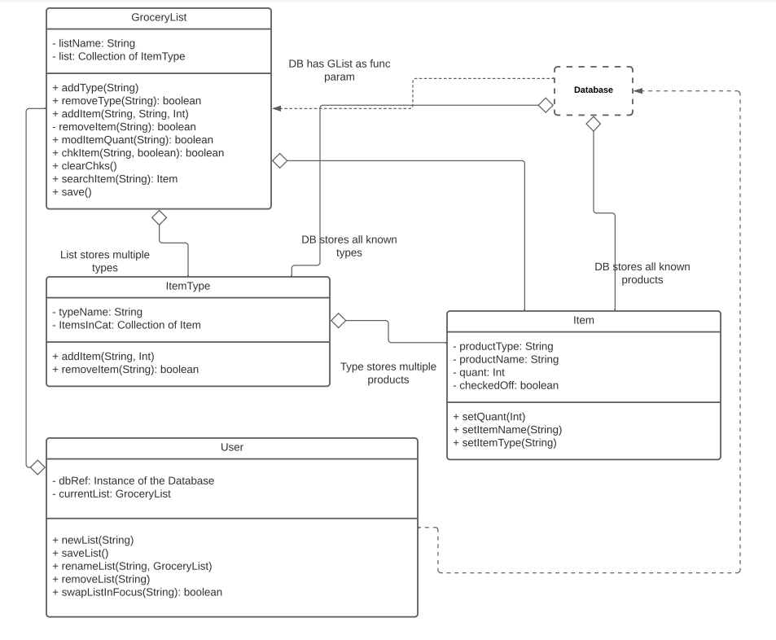

# Discussion of Class Diagrams

### Design 1:

Pros:
+ Has most required classes
+ Good Design Structure:
+ Easy to follow relationships
+ Diagram is easy to understand

Cons:
+ Lack of fulfilling all requirements (specify which)
+ More functions needed in each class
+ Missing User Class

### Design 2:

Pros:
+ All requirements fulfilled
+ Easy to follow
+ Relationships are understood
+ Simple design layout

Cons:
+ More details needed: Missing attributes and missing methods
+ Addition of features that are not requirements

### Design 3:

Pros:
+ Easy to Follow
+ Follows the requirements precisely
+ Nicely structured

Cons:
+ Relationships need to be refined
+ Extra features that are not necessary, not in the requirements
+ Extra attributes that do not necessarily need to be presented

### Design 4:

Pros:
+ Has a lot of detail
+ Meets all the requirements
+ Relationships are labeled

Cons:
+ Some details that are unnecessary are presented
+ Class names do not correspond as written in the requirements
+ Relationships need to be refined

### Design 5:

Pros:
+ Meets the requirements
+ Labeled relationships
+ Good Details

Cons:
+ Too many extra features
+ Unrelated Class names
+ Extra classes that are unnecessary

### Design 6:

Pros:
+ Straightforward design
+ Visually friendly with colors
+ Readable and easy to understand

Cons:
+ Relationships need refinement
+ Unneeded functions
+ Unneeded classes
+ Inclusion of Android specific design

### Team Design:

We decided that Marlon&#39;s Diagram was the best of the diagrams presented but just had too much detail. We modified the diagram so that it was simpler to make sure that understanding was clear. We discussed some design considerations from other diagrams and included it here. This includes simplifying the database class, adding methods to each class, moving methods that were once in one class, and the relationships between classes.

### Summary:

We learned the best way for us to communicate and coordinate. We were able to effectively and constructively criticize each other&#39;s work. Through looking at the different diagrams we were able to assess and analyze our own UML designs to ensure good design. We effectively communicated the considerations we made when making our own designs that enabled us to find flaws in our own designs and to find the strengths in our own and each other&#39;s design. We were able to very quickly find a communication method that worked for all of us so that everyone was heard, and so that everyone was able to participate.