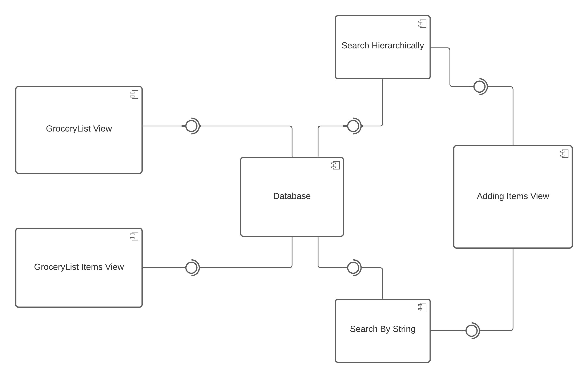
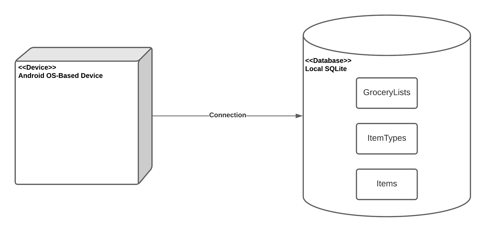
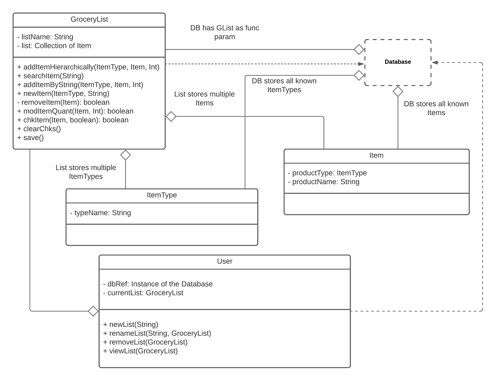
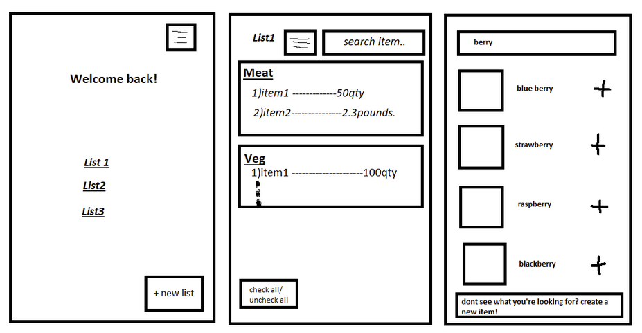

# Design Document Version 2.0

**Author**: \<Team2\>

## 1 Design Considerations

### 1.1 Assumptions

We assume that the application will be run on a local machine and will be downloaded through an .apk file and won’t be readily available through the google play store. We also assume that the application will be run on an android device with API 21 or higher.

### 1.2 Constraints

The lists will be stored locally, so if the user deletes the app, the user might lose the list data. The user also will not be able to share the lists to other users since this app is locally saved and has no online functions. Depending on the budget of the user the app could have limited functions.

### 1.3 System Environment

Android OS based phones, Android OS based Tablets, and general Android based devices will be used to operate the Grocery List app. Minimum API level targeted will be 21.

## 2 Architectural Design

The architecture provides the high-level design view of a system and provides a basis for more detailed design work. These subsections describe the top-level components of the system you are building and their relationships.

### 2.1 Component Diagram

### 2.2 Deployment Diagram

## 3 Low-Level Design

### 3.1 Class Diagram

## 4 User Interface Design
\
*This is just the initial design. The design will be updated as more data is gathered.*
