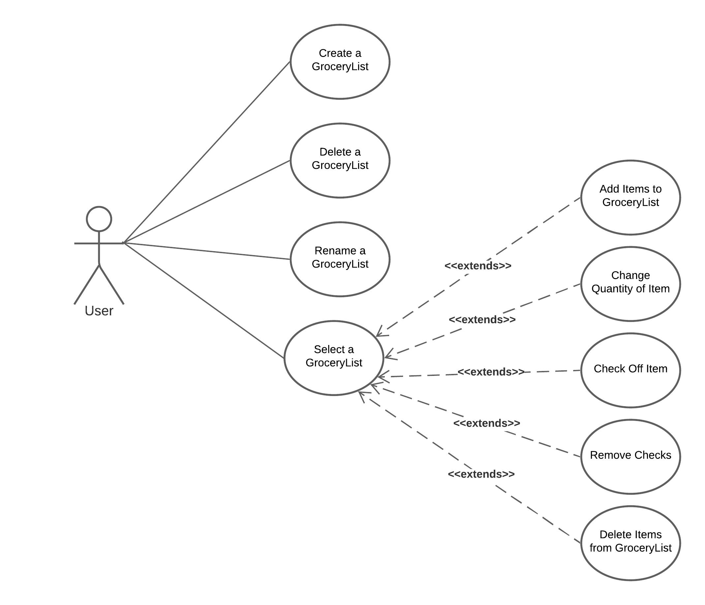

# Use Case Model

**Author**: \<Team2\>

## 1 Use Case Diagram

## 2 Use Case Descriptions

### Create a GroceryList
- Requirements: The user must be able to create a grocery list and give it a name
- Pre-conditions: The user must have the app open
- Post-conditions: A new grocery list must be available
- Scenarios: The user wants to create a new grocery list. The user taps the button to create the grocery list and gives it a name. A new grocery list is created.

### Delete a GroceryList
- Requirements: The user must be able to delete a grocery list
- Pre-conditions: At least one grocery list must exist
- Post-conditions: The grocery list must be successfully deleted
- Scenarios: The user wants to delete a grocery list. The user either taps on the list and then presses the delete button. The list is removed from the user's device.

### Rename a GroceryList
- Requirements: The user must be able to rename a grocery list
- Pre-conditions: At least one grocery list must exist
- Post-Conditions: The grocery list with the same content will appear but with a different name
- Scenarios: The user wants to change the name of a grocery list. The user taps on a grocery list and then presses the rename button. The user gives it a name and then the a grocery list with the same contents will now be shown with a different name.

### Select a GroceryList
- Requirements: The user must be able to select a grocery list for viewing
- Pre-conditions: At least one grocery list must exist
- Post-Conditions: A view of the grocery list's items must be visible to the user
- Scenarios: The user wants to view the contents of a grocery list. The user taps on the specific grocery list they would like to view. The user then presses the view button. The user enters the selected list and can see the items and their quantities under their respective item types.

### Add Items to GroceryList
- Requirements: The user must be able to add items to their selected grocery list
- Pre-conditions: A grocery list must be selected
- Post-conditions: An item with the designated quantity is added to the grocery list
- Scenarios: The user wants to add items to the grocery list they are viewing. The user taps on the + button and is given a choice of using the hierarchical system of item types and items, or to search for an item by its name. The user then selects the item they are looking for and the item is added to the list.

### Change Quantity of Item
- Requirements: The user must be able to change the amount of each item on their selected grocery list
- Pre-conditions: A grocery list must be selected, and that grocery list must have at least one item in it
- Post-conditions: The amount of the item whose quantity was intended to be changed now shows the new quantity desired
- Scenarios: The user realizes that they need more or less of an item. The user taps on the quantity of an item. The app prompts the user for a new quantity and the user indicates the new quantity desired. The grocery list reflects the new quantity of that item.

### Check Off Item
- Requirements: The user must be able to check off an item on their grocery list
- Pre-conditions: A grocery list must be selected, and that grocery list must have at least one item in it
- Post-conditions: The item has a check mark next to it indicating that the already has that item
- Scenarios: The user grabs an item that is on their grocery list. The user taps on the check box next to the item name on the list. The item is now checked off to show that the user has it.

### Remove Checks
- Requirements: The user must be able to remove all checks on the grocery list
- Pre-conditions: A grocery list must be selected, and that grocery list must have at least one item in it, and at least one item with a check next to it
- Post-conditions: All of the check boxes next to the items are empty
- Scenarios: The user grabs multiple items that are on their grocery list. The user taps on the check boxes next to the item names on the list. The user then decides not to take anything home and wants to uncheck all of the items. The user pushes the Clear Checks button and all the checkmarks are removed.

### Delete Items from GroceryList
- Requirements: The user must be able to delete an item from their grocery list
- Pre-conditions: A grocery list must be selected, and that grocery list must have at least one item in it
- Post-conditions: The item that is selected for deletion must be removed from the grocery list
- Scenarios: The user has purchased some but not all of the items on their grocery list. The user will go to another store but wants to remove some items that they have from their list. The user then taps on the delete button next to the item. The item then disappears from the list.