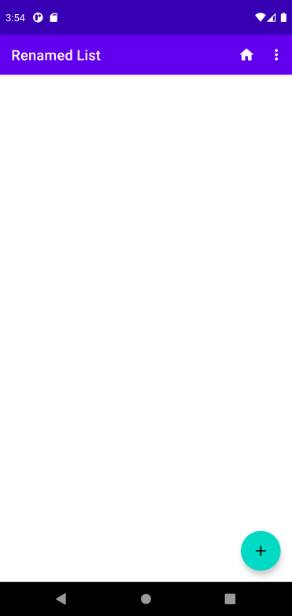
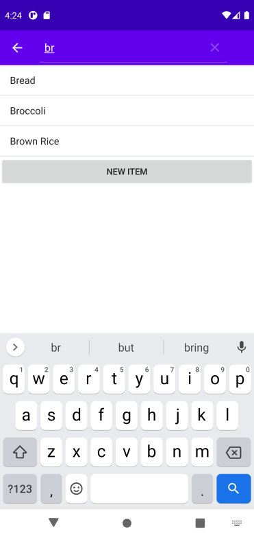

# User Manual Version 2.0

**Author**: \<Team2\>

### Summary:

The GroceryListManager app helps users develop grocery shopping lists and provides a better shopping experience. It helps users to easily add, erase, and cross things off their to-do lists. The user will make several lists for various occasions and monitor them all on their phone.

## 1. Creating a Grocery List  

Tap on the New List button  
  

You will then be prompted to enter a name for your grocery list  
  

A new grocery list with the provided name will now populate  
  

## 2. Renaming a Grocery List  

In order to rename a list you must first tap on the list. This will then bring up another view where you will be able to push a button to rename the list  
  

When renaming the list, a popup appears that prompts the user for the new list name  
  

After providing a new name for the list, the list will now reflect the name change  

## 3. Deleting a Grocery List

To delete a grocery list, you must first tap on the list. On the menu that pops up, you will be able to push a button to delete the list  
   

After tapping the delete button, a confirmation message appears  

After confirming that it was your intention to delete the grocery list, the list is removed  

## 4. Viewing Items in a Grocery List

To view the items in a grocery list, you must first tap on the list. On the menu that pops up you will be able to push the button to view the list  

This will bring you to a view of all the items in the list. The list shown here is empty.  

## 5. Adding Items to a Grocery List

To add items to the grocery list, you must tap on the New Item button  

This will then provide different methods of adding items to the list  

### 5.1 Adding Items by Searching By String

To add items by a string search, you must tap on the Item Search button  

You will then be taken to a screen where you will be presented all items that exist in the database  

You are then able to search through the list by pressing the magnifying glass button  

As you start typing the name of your desired item, the results start to get refined  

If you find your desired item, tap on it and you will be prompted for the Item Type you require, and then the quantity desired  

If you do not find your desired item, tap on the New Item button at the end of the list  

This will then prompt you for the Item Type of the new item, and then will prompt you for the quantity desired. This will add the new item to the local database.  

### 5.2 Adding Items by Searching Hierarchichally

To add items hierarchically, you must tap on the Type Search button  

You will then be taken to a screen where you will be able to choose from the given Item Types from a Spinner  

Once you choose an Item Type you will be able to choose from the available Items of that Item Type  

Once you select an Item, you will be prompted for the quantity desired of that Item  

After adding the Items they will appear on the list grouped by their Item Types  

## 6. Checking Off an Item

To check off an item simply press the checkbox next to the desired item(s)  

This will then display a checkmark next to the item  

If you would like to remove all check marks from the list, press the 3 dots in the upper right and then the Clear Checks Button  

The list will now show all items unchecked  

## 7. Changing the Quantity of an Item

To change the quantity needed of an item, press on the quantity the item currently has  

This will then ask you for the new quantity for the item  

The new quantity will be reflected on the grocery list  

## 8. Deleting an Item From the List

To delete an item from the list, press on the delete button next to the item  

When the button is pressed, a confirmation message appears  

Once you confirm that you would like to delete the item, the item is removed from the list  
